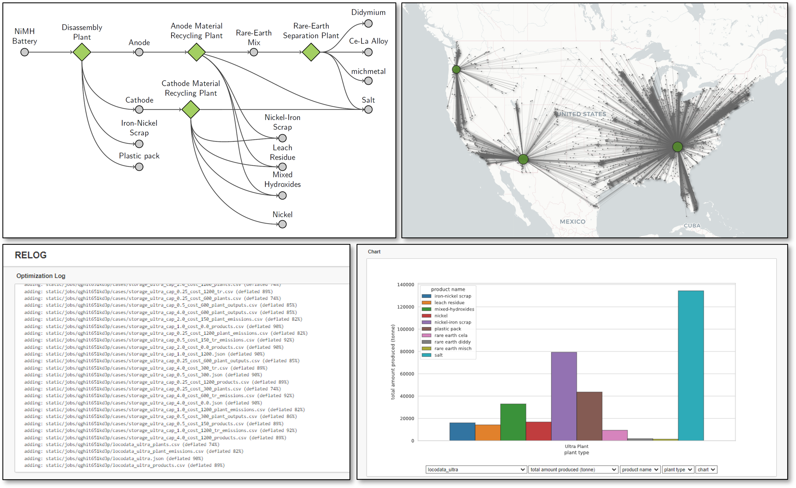

# RELOG -- Supply Chain Design, Analysis and Optimization

**RELOG** is an open-source package designed to optimize supply chains for
forward, reverse and circular manufacturing. Using mixed-integer linear
optimization, RELOG helps users determine strategic decisions such as:

- Where and when to build manufacturing and recycling plants
- The size of these plants, when to expand them, and by how much
- The sources for each plant's input materials and the destinations for their
  processed outputs
- Whether to process input materials immediatelly or store them for later use

RELOG has been successully applied in research at various laboratories and
universities, focusing on areas like critical material recovery from spent NiMH
and Li-Ion batteries, biomass processing for hydrogen production, and the
recycling of electronics, plastics and solar PV materials, among others. See
references for more details.

## Screenshots
```@raw html
<center>
   
</center>
```

## Authors

- **Alinson S. Xavier,** Argonne National Laboratory <axavier@anl.gov>
- **Nwike Iloeje,** Argonne National Laboratory <ciloeje@anl.gov>
- **Kavitha G. Menon,** Argonne National Laboratory
- **John Atkins,** Argonne National Laboratory
- **Kyle Sun,** Argonne National Laboratory
- **Audrey Gallier,** Argonne National Laboratory

## License

```text
RELOG: Reverse Logistics Optimization
Copyright © 2020-2025, UChicago Argonne, LLC. All Rights Reserved.

Redistribution and use in source and binary forms, with or without modification, are permitted
provided that the following conditions are met:

1. Redistributions of source code must retain the above copyright notice, this list of
   conditions and the following disclaimer.
2. Redistributions in binary form must reproduce the above copyright notice, this list of
   conditions and the following disclaimer in the documentation and/or other materials provided
   with the distribution.
3. Neither the name of the copyright holder nor the names of its contributors may be used to
   endorse or promote products derived from this software without specific prior written
   permission.

THIS SOFTWARE IS PROVIDED BY THE COPYRIGHT HOLDERS AND CONTRIBUTORS "AS IS" AND ANY EXPRESS OR
IMPLIED WARRANTIES, INCLUDING, BUT NOT LIMITED TO, THE IMPLIED WARRANTIES OF MERCHANTABILITY
AND FITNESS FOR A PARTICULAR PURPOSE ARE DISCLAIMED. IN NO EVENT SHALL THE COPYRIGHT HOLDER OR
CONTRIBUTORS BE LIABLE FOR ANY DIRECT, INDIRECT, INCIDENTAL, SPECIAL, EXEMPLARY, OR
CONSEQUENTIAL DAMAGES (INCLUDING, BUT NOT LIMITED TO, PROCUREMENT OF SUBSTITUTE GOODS OR
SERVICES; LOSS OF USE, DATA, OR PROFITS; OR BUSINESS INTERRUPTION) HOWEVER CAUSED AND ON ANY
THEORY OF LIABILITY, WHETHER IN CONTRACT, STRICT LIABILITY, OR TORT (INCLUDING NEGLIGENCE OR
OTHERWISE) ARISING IN ANY WAY OUT OF THE USE OF THIS SOFTWARE, EVEN IF ADVISED OF THE
POSSIBILITY OF SUCH DAMAGE.
```
